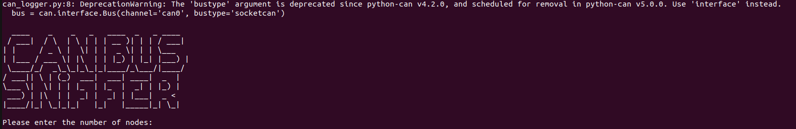
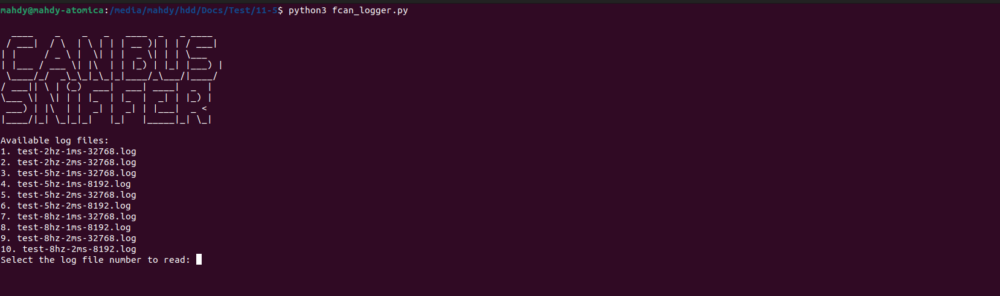

# CAN Bus Data Saving Tool

This is a tool used for saving CAN bus data on Linux using `candump` from the `can-utils` tool. It also features translation for some of the commands, such as:

- **PDO** (Process Data Object)
- **SDO** (Service Data Object)
- **NMT** (Network Management) transmission and reception

The tool uses **python-can** which has similar featers to can-utils (candump-vcan-...etc)

## Steps to Install `can-utils` on Linux

`can-utils` is a collection of CAN bus utilities for Linux. Follow these steps to install it on your Linux system:

1. **Update Your Package List & install can utils**
   Open a terminal and update your package list:
   ```bash
   sudo apt-get update
   sudo apt install can-utils
   pip install python-can


## How to Use CAN Logger (Terminal Sniffer Version)

1. **Run CAN interface between the pi & the EPOS**

2. **In a seperate terminal**

   ```bash
   python3 can_logger.py
   ```

3. **Select number of nodes**

    

4. **Data is saved in .cpp file for clarity**

## How to Use CAN Logger (File Parser Version)

1. **Copy** *fcan_logger.py* **to the dir of log files**

2. **In a terminal**

   ```bash
   python3 fcan_logger.py
   ```

3. **Select the log file**

    

4. **Select number of nodes**

5. **Data is saved in .cpp file for clarity**
